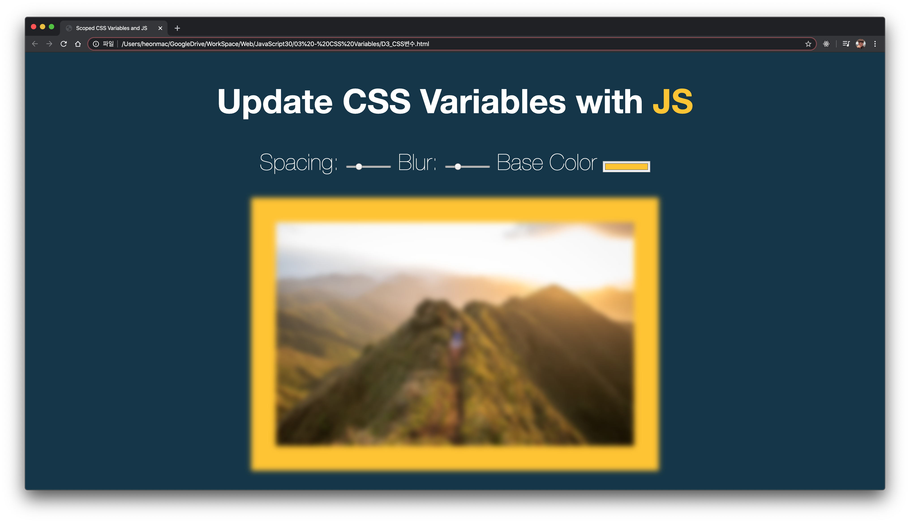
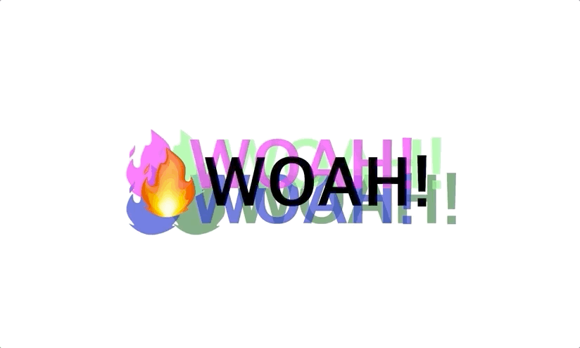

# JavaScript30


[소개페이지](https://JavaScript30.com) 

바닐라 자바스크립트로 하루에 하나 씩 30일동안 만드는 무료 강의

영어지만 이해하기 어렵지않고 모르는것은 찾아보는식으로 공부했습니다.

아래 내용들은 웹페이지의 구동모습과 만들면서 생각하거나 알게되거나 한것들을 적어두었습니다.


---


### __Day 1 JavaScript Drum Kit__


오디오 소스를 이용해 

키입력이 들어오면 자바스크립트로 오디오소스를 재생시켜주는 웹페이지

```querySelector```를 이용해 html의 원하는 태그를 가져와서 자바스크립트로 컨트롤할수 있다는것을 공부함  

<br><br>


### __Day 2 Js and CSS Clock__
 

자바스크립트로는 ```new Date()```를 이용해 현재의 시간을 가져와서

CSS로 역동적인 시계의 움직임을 줌. 

```setInterval```을 이용해 1초마다 한번씩 갱신함.

<br><br>


### __Day 3 CSS Variables__

CSS에서도 변수를 만들어 특정 부분에 원하는 변화를 줄수있다.

그것을 자바스크립트에서 컨트롤이 가능하다.

dataset을 이용해서 data-## 부분들에 접근할수 있다.

<br><br>


### __Day 4 Array Cardio Day 1__

자바스크립트의 배열에 대해서 공부하는 1번째 단계

```filter```함수에는 함수로 조건을 넘겨 원하는 조건을 이용해서 필터링을 할수있다

```map``` 함수는 반복해서 배열안에 있는 데이터를 이용할수있다. 
예를들어 예시에서는 배열안에 들어있는 값들사이에 공백을 넣어줬다.

```sort``` 함수는 정렬함수이다.
정렬조건을 함수로 제공해주면 그 정렬조건에 맞춰서 정렬을 할수 있다.

```reduce``` 함수는 제공된 함수를 실행해 하나의 결과값을 출력해준다.
예제에서는 inventors 배열에있는 모든 발명가들의 생존년도를 더해서 출력했다.
<br><br>


### __Day 5 Flex Panel Gallery__

CSS의 Flex에 대한 설명과 자바스크립트로 html에 특정 class를 토글할수있다는것을 배웠다.
<br><br>


### __Day 6 Type Ahead__

외부에서 JSON 파일을 불러와 배열에 다시 저장하고, 그값을 검색한뒤에 최종적으로 일치하는 값을 사용자에게 출력해주는 웹페이지

검색하려고 하는 값을 검색결과에서 하이라이트 시켜줌.

RegExp 라는 함수를 사용하게 됬는데 정규식에 일치하는 문자를 다른문자열로 변경할수 있음.
<br><br>


### __Day 7 Array Cardio Day 2__

배열을 공부하는 두번째 날

```some``` 배열안의 요소중 하나라도 만족하면 참을 출력한다.

```every``` 배열안의 모든 요소가 만족해야 참을 출력한다.

```find``` 배열안에 만족하는 값을 하나 출력한다.

```findIndex``` 배열안에 만족하는 값의 인덱스를 출력한다.
<br><br>


### __Day 8 Fun With HTML5 Canvas__

캔버스를 이용해 간단한 선을 그려보는 웹페이지

생각보다 단순하게 안된다는것을 알았다.

웹페이지에 원하는 영역에 캔버스를 만들기위해 웹페이지 자체의 높이와 넓이도 필요하고

구한다음에 그림을 그리는것도 마우스기준으로 마우스의 좌표값을 가져와서 초기값과 이동한값을들 다 구해와야했다.

ES6문법도 하나 알게됬다. 값을 바꿔야할때 


```    
[lastX, lastY] = [e.offsetX,e.offsetY]; 
```

이런식으로 호출하면 굳이 두줄에 적지 않아도 않아도 쉽게 적을수 있다.

<br><br>


### __Day 9 Dev Tools Domination__


다양한 콘솔 명령어에 대해서 알게됬다.

```
console.log()
```
만 있는게 아니다 라는걸 배웠다.

<br><br>


### __Day 10 Hold Shift and Check Checkboxes__

그냥 체크박스를 체크할떄는 그냥 체크되지만

쉬프트를 누르고 체크한다음 다른 박스를 체크하면

그사이의 체크박스들이 다 체크가 되는 웹페이지

`lastChached`라는 플래그를 두어서 이값과 마지막에 누른값들사이에 있던 체크박스를 모두 체크해준다.

<br><br>


### __Day 11 Custom Video Player__

정해진 비디오에 플레이어기능을 만들어본 웹페이지

생각보다 쉽게 자바스크립트로 비디오를 컨트롤할수있다는것에 놀라웠다..

자바스크립트는 도대체 못하는게 뭘까 싶었다

3항연산자가 생각보다 정말 유용하게 잘쓰인다.

<br><br>


### __Day 12 Key Sequence Detection__

제작자는 코나미커맨드에 영감이 떠올라서 만들어봤다고한다

특정 입력이 제공되었을때 랜덤한 유니콘 이미지가 웹페이지에 추가된다.

`window`에서 실시간으로 키입력을 받아 입력된 키가 정해진 변수에있는 키와 일치하면 함수를 실행해 유니콘이 생긴다.

입력된 값들이 저장되는 배열에 `join`함수를 이용해서 공백을 제거해 단어로 인식시킨다.

<br><br>


### __Day 13 Slide in on Scroll__

스크롤시에 슬라이드로 이미지가 추가되는 웹페이지

이미지의 위치를 구해서 스크롤됬을때 이미지의 중간부분을 넘어갔을경우

이미지에 class를 추가해서 지정되있는 에니메이션을 나타내고 고정

다시 웹페이지밖으로 벗어나면 원래 안보이던 상태로 돌아온다.

<br><br>

### __Day 14 JavaScript References VS Copying__

자바스크립트에서는 일반적인 변수(`let, var`)로 선언된 문자, 숫자 변수의 경우 복사를 해도 참조가 아닌 복사를 수행한다..... 만 변수만 그렇고

배열이나 객체의경우는 변수복사하듯이 복사할경우 참조가 되어 원래 값을 수정해버려 의도치 않은 동작을 하게된다.

그래서 참조가아닌 복사하는 방법을 배우는 코스

ES6로 생긴 방법도 소개해줘서 좋았다.

<br><br>


### __Day 15 LocalStorage__

브라우저 안에있는 로컬스토리지를 사용하는 방법을 알게되었다

로컬스토리지는 문자열임으로 자바스크립트 상에서 배열로 사용하려고 할떈

JSON으로 변환해서 배열에 넣어야한다.

물론 저장할때도 JSON으로 변환해서 배열문자열을 만들어서 출력해야한다

안그러면 `[object object]`이라는 문자열로 저장해 아무것도 모르게된다.

<br><br>




### __16 - Mouse Move Shadow__

마우스의 움직임을 저장해 그림자를 변화시키는 웹페이지

마우스의 움직임을 자바스크립트로 불러와서 그림자의 위치값에 변화를 준다.

<br><br>


### __Day 17 - Sort Without Articles__

문자열의 앞에있는 The, An, A같은 관사를 제외하고 정렬을 하는 방법을 배웠다

이번에는 `replace`함수를 이용해 정규표현식으로 a, an, The를 공백으로 바꾼다음 정렬한다

정렬했다고해도 원래있던값은 건들지 않았음으로 정상적으로 모든 문자가 출력된다.

<br><br>


### __Day 18  Adding Up Times with Reduce__

리듀스 함수를 이용해 시간, 분, 초를 출력하는 코드를 작성해봤다.

먼저 제공되있는 시간을 모두 초로 바꾼다음에

초를 시간으로 바꾸고

거기서 남은 초를 다시 분으로 바꾸는식으로 

콘솔에 최종 시간 분 초가 출력되게 되어있다.

<br><br>


### __Day 19 Webcam Fun__

웹캠으로 이리저리 다양한 효과를 주는것을 만들어보았다.

흔히 말하는 크로마키를 만들어볼수도 있었고..

영상의 색을 변조하거나 하는것도 할수있었다.

학교에서 들었던 신호처리 수업때 어느정도 비슷한것을 해본것 같았는데

뭔가 이번엔 내 얼굴보이는 웹캠으로 하니 더신박했다

<br><br>


### __Day 20 Speech Detection__

생각보다 어렵지 않았던 음성인식출력기를 제작해 봤다

자바스크립트가 다룰수있는게 엄청나게 다양한것을 알게됬다

다른 외부 api를 필요로하는게 아니라 내부적으로 구현되있다니;

``` 
window.SpeechRecognition = window.SpeechRecognition || window.webkitSpeechRecognition;
```

이한줄을 통해 웹브라우저에 마이크 사용요청을 하고 음성인식을 할수있다

물론 인식된 결과값을 다루는것은 사용자의 몫이지만.

<br><br>


### __Day 21 Geolocation__

위치정보를 브라우저에서 이용할수 있는법을 알려준다

```
navigator.geolocation.watchPosition
```

이코드를 통해 현재 웹브라우저가 실행중인 기기의 `geolocation`값을 가져올 수 있다.

물론 사용자의 동의가 필요하고 브라우저의 서버가 https보안연결이 필요하지만.. 사실 예전에 프로젝트를 진행하면서 한번 사용해봐서 익숙했다

정보값에 위치정보만 있는게아니라 현재 가속도, 바라보고있는 뱡향등이 있어 제작한 웹페이지처럼 보고있는 방향과 속도를 표시해줄수 있다는것을 알게되었다

<br><br>


### __Day 22 Follow Along Link Highlighter__

링크에 마우스 커서가 다가가면 하이라이터를 링크의 크기에 맞춰서 보여주고 다른 링크로 커서가 움직이면 하이라이터가 이동하면서 크기가 변경되서 새로 가르키고 있는 링크쪽으로 이동한다.

뒤에 강의에서 이걸 이용한 다른 웹페이지를 제작한다고 한다.

나는 처음에 `EventListener`에 `mousemove`시에 하이라이터를 이동시켰지만 움직일때보다는 링크영역에 들어갔을때인 `mouseenter`가 더 맞는거 같다

아 그리고 브라우저가 스크롤됬을때 하이라이터가 따로 움직이게 되는 증상이 보이는데 그걸 `scrollX`와 `scrollY`를 하이라이트의 바뀔 좌표에 추가해서 넣어줌으로 해결할 수 있었다.

<br><br>


### __Day 23 Speech Synthesis__

입력된 문장을 스피치엔진을 이용해 소리로 출력해준다 스피치엔진은 OS에 따라서 다르게 제공되기 때문에 웹페이지를 사용하는 환경에 따라 다른 스피치엔진을 사용하게 된다.

나는 한국인이니까 한국 음성엔진과 영어는 있어야겠다 싶어서 영어 엔진만 필터링해서 선택하게 해뒀다.

`msg`라는 변수안에 ``SpeechSynthesisUtterance``라는 Web Speech api를 저장해주고 사용했다

`SpeechSynthesisUtterance`안에 발음할 텍스트,음성,피치,레이트를 저장해 저장된 변수대로 음성이 출력되었다.

<br><br>


### __Day 24 Sticky Nav__

상단에 네비게이션바를 고정하는 테크닉을 배우게 되었다.

일단 CSS로 위치를 고정시키는데.. 이걸 자바스크립트로 클래스를 플래그로 이용해서 위치를 고정했다가 바꿧다 할수있게 되어있다.

위치가 바뀌면서 웹페이지의 타이틀? 로고?도 보이게 할수있었다.

그리고 한가지 테크닉을 더 알게 되었는데 HTML태그중 제일 바깥에서 감싸고 있는 태그에 트리거 역활을 하는 클래스를 넣어주고 세부 태그에 CSS로 지정을해서 과하게 CSS나 클래스를 추가하지 않아도 많은 변화를 줄 수 있다.

<br><br>

### __Day 25 Event Capture, Propagation, Bubbling and Once__

브라우저에서 이벤트를 추가할때 어떤식으로 찾고 반응하고 감싸주는지 배웠다

3개의 div가 있고 안쪽에 있는 div에 이벤트를 원해서 이벤트를 발생시켰을때 기본적으로는 안쪽에있는 div부터 바깥에있는 태그까지 모든 이벤트를 확인하고 발동시킨다.

물론 반대로 겉에있는 부분부터 이벤트가 발생되게 할 수도 있고. 원하는 div에있는 이벤트만 발생시킨뒤에 감싸고있는 것들의 이벤트는 발생시키지 않을 수 있다.

<br><br>


### __Day 26 Stripe Follow Along Nav__

22번째 강의의 연장선 네비게이션 바의 포함되어있는 콘텐츠들의 배경을 자연스럽고 부드럽게 움직이게 했다.

`getBoundingClientRect`함수를 이용해서 태그의 좌표값들을 불러와 배경에 넣는식으로 작업한다.

단순히 Width값과 Heigth값만 이용할경우 이상한 위치에 배경이 위치하게 되는데 그 이유는 네비바의 높이를 고려하지 않고 배경영역만 지정했기 떄문이다. 그래서 추가로 top값과 left값을 구하게 되는데 원래 배경의 좌표값에서 네비게이션의 높이와 길이만큼 빼줘야지 자연스럽게 위치한다.

영상에서 제공하는 소스는 강의하는 선생님의 정보로 되어있어서 내정보로 정보들을 바꾸었다. 링크부분에는 내 깃허브 저장소들을 링크시켰다.

<br><br>


### __Day 27 Click and Drag__

화면을 클릭하고 드래그하면 횡스크롤이 되는 웹페이지

마우스의 클릭, 공간접근, 움직임을 이벤트리스너로 감시하고 마우스클릭을 트리거로 두어 누른상태부터 마우스가 이동한구간까지의 거리를 구해 스크롤되야하는 부분의 scrollLeft값에 변화를 줌으로써 클릭 앤 드래그가 가능해진다.

<br><br>


### __Day 28 Video Speed Controller__

영상의 속도를 조절하는 컨트롤러를 만들어봤다.

`HTML`의 `video`태그의 `playbackRate`속성에 값을 제공해주면 재생속도가 변경된다. 기본값은 1이다

속성값은 검색해서 찾았지만 재생속도의 최저값과 최고값을 설정해주는것을몰라 영상을 참고해서 할수 밖에 없었다..

<br><br>


### __Day 29 Countdown Timer__

타이머를 구현하는 웹페이지를 만들었다

인터벌을 그냥 막쓰면 꼬인다는것부터 배우면서 시작했다.

`querySelectorAll`를 선택할시에 특정하게 명시되어있는것을 호출하는것이 명확하게 원하는 태그를 불러올수있다.

태그에 `name`이있으면 `querySelector`통하지 않아도 태그를 찾아서 사용할 수 있다.

강의에서는 분단위까지만 구현했지만 시간단위까지 구현했고

최대한 내가 아는 지식으로만 해보려고 했다...만 역시나 힘들었다


<br><br>


### __Day 30 Whack A Mole__

일명 두더지 잡기 게임을 자바스크립트로 만들어봤다

강의를 보고 하려다 보다보니 그냥 내가 알고있는 지식으로 해도 되겠다 싶어서 알고있는걸로 다 해봤다.

결과는 성공. 

처음에 시간을 정하는것만 강의를 참고했다. 나머지 기능들은 순수 구현. 두더지를 중복 클릭하면 접수가 계속 입력되길래 두더지의 `Class`에 `up`이 있는 상황과 플래그 부울변수인 `scoreUp`을 하나 만들어서 이 변수가 ture가 되면 클릭이 안되도록 제작했다.

게임은 10초동안 진행되며 진행되는 10초동안에는 버튼이 사라지도록 했다. 혹시나 두더지 누르다가 다시 눌러서 게임 처음부터 시작하면 기분 나빠서다.

